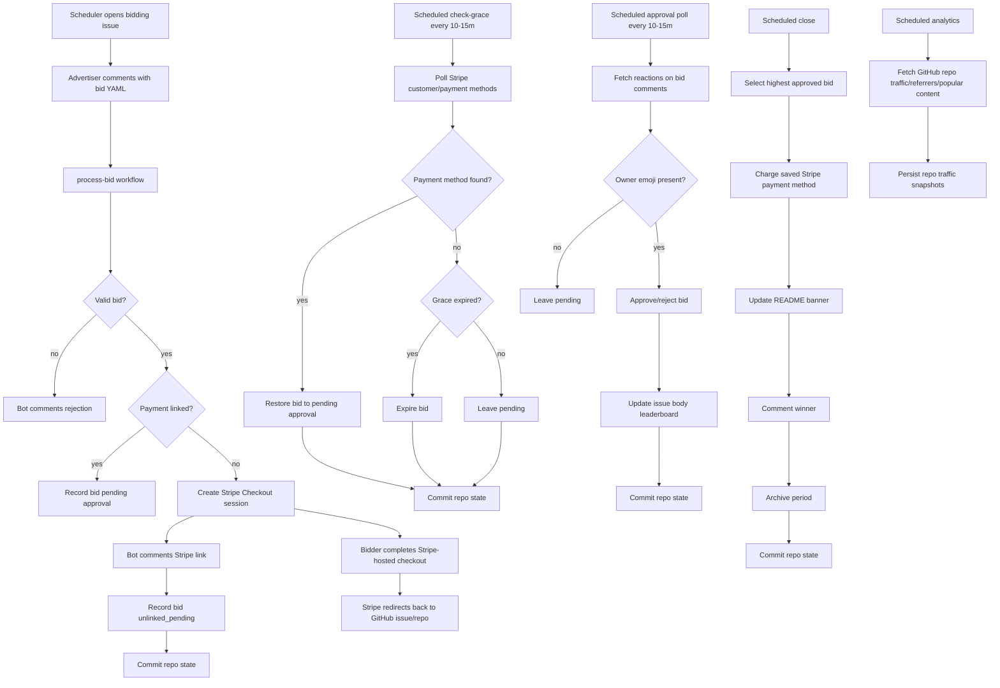

# BidMe V1 Flow

```mermaid
flowchart TD
  A[Scheduler opens bidding issue] --> B[Advertiser comments with bid YAML]
  B --> C[process-bid workflow]
  C --> D{Valid bid?}
  D -- no --> E[Bot comments rejection]
  D -- yes --> F{Payment linked?}
  F -- yes --> G[Record bid pending approval]
  F -- no --> H[Create Stripe Checkout session]
  H --> I[Bot comments Stripe link]
  I --> J[Record bid unlinked_pending]
  J --> K[Commit repo state]

  H --> L[Bidder completes Stripe-hosted checkout]
  L --> M[Stripe redirects back to GitHub issue/repo]

  N[Scheduled check-grace every 10-15m] --> O[Poll Stripe customer/payment methods]
  O --> P{Payment method found?}
  P -- yes --> Q[Restore bid to pending approval]
  P -- no --> R{Grace expired?}
  R -- yes --> S[Expire bid]
  R -- no --> T[Leave pending]
  Q --> U[Commit repo state]
  S --> U
  T --> U

  V[Scheduled approval poll every 10-15m] --> W[Fetch reactions on bid comments]
  W --> X{Owner emoji present?}
  X -- yes --> Y[Approve/reject bid]
  X -- no --> Z[Leave pending]
  Y --> AA[Update issue body leaderboard]
  AA --> AB[Commit repo state]

  AC[Scheduled close] --> AD[Select highest approved bid]
  AD --> AE[Charge saved Stripe payment method]
  AE --> AF[Update README banner]
  AF --> AG[Comment winner]
  AG --> AH[Archive period]
  AH --> AI[Commit repo state]

  AJ[Scheduled analytics] --> AK[Fetch GitHub repo traffic/referrers/popular content]
  AK --> AL[Persist repo traffic snapshots]
```
