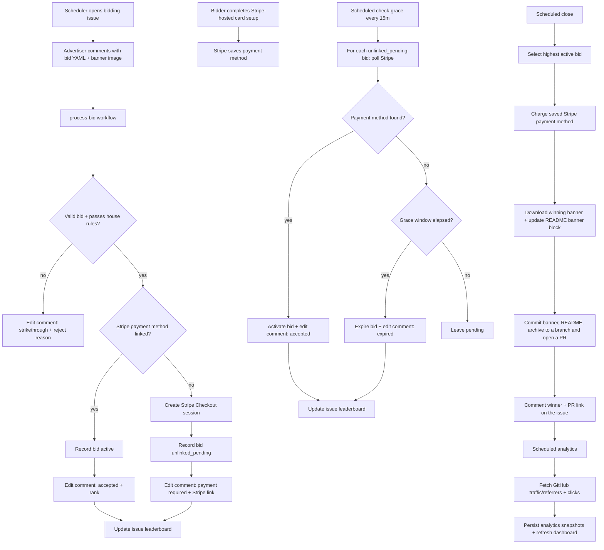

# BIDME V1 Flow

There is no owner approval step. A bid is valid the moment Stripe is linked, and
the highest active bid at close wins. The owner's only gate is
`content_guidelines.prohibited` (house rules, e.g. "crypto"); anything else is
handled by the owner deleting a comment manually.

On close, BIDME does **not** push to `main` directly. It downloads the winning
banner into the repo, updates the README to reference it (with a link below the
banner back to the winning bid comment), archives the period, and opens a PR.
Merging the PR publishes the banner.
